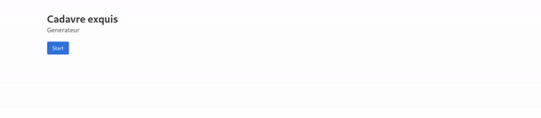
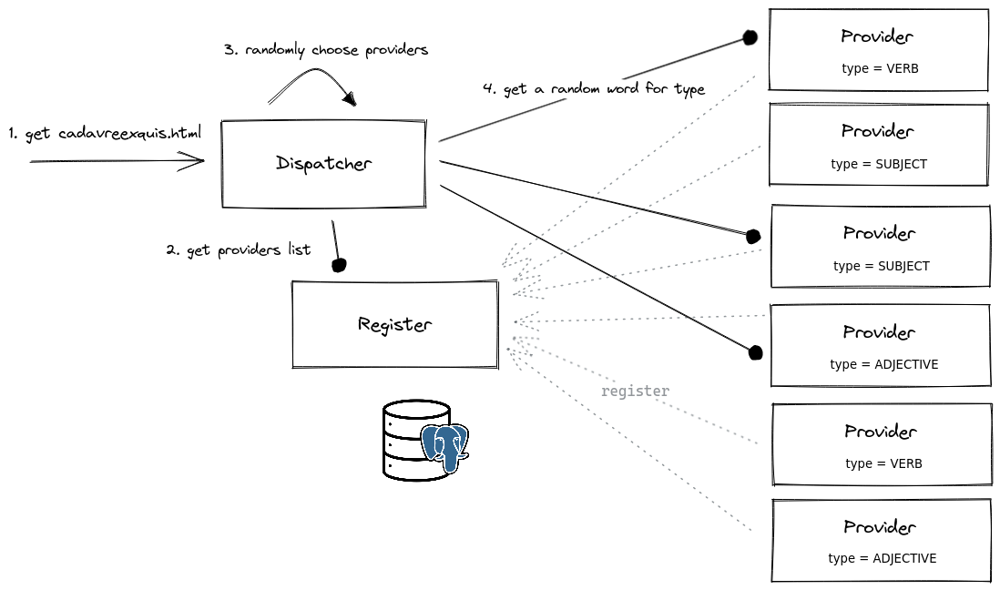

# Cadavre exquis



## Local run

```bash
./local_docker.sh
```

## Architecture



## Configuration

### Common

| Env Var       | Description            | Default     |
|---------------|------------------------|-------------|
| `INSTANCE_ID` | Define the instance id | Random UUID |
| `APP_ID`      | Application id         | `""`        |

### Dispatcher

| Env Var         | Description                                     | Default |
|-----------------|-------------------------------------------------|---------|
| `PORT`          | Http port to listen to                          | `8080`  |
| `REGISTER_URLS` | Url to call registers on (list splitted by `,`) | N/A     |

### Register

| Env Var                     | Description                        | Default |
|-----------------------------|------------------------------------|---------|
| `PORT`                      | Http port to listen to             | `8080`  |
| `STORAGE`                   | Define storage target (PG, MEMORY) | `PG`    |
| `POSTGRESQL_ADDON_HOST`     | Postgresql host                    | N/A     |
| `POSTGRESQL_ADDON_PORT`     | Postgresql port                    | N/A     |
| `POSTGRESQL_ADDON_DB`       | Postgresql database to use         | N/A     |
| `POSTGRESQL_ADDON_USER`     | User for postgrsql connection      | N/A     |
| `POSTGRESQL_ADDON_PASSWORD` | Password for postgrsql connection  | N/A     |

### Provider

| Env Var           | Description                                                               | Default                     |
|-------------------|---------------------------------------------------------------------------|-----------------------------|
| ` PORT`           | Http port to listen to                                                    | `8080`                      |
| `REGISTER_URLS`   | Url to call registers on (list splitted by `,`)                           | N/A                         | 
| `PROVIDER_TYPE`   | Define the provider type of the instance (`VERB`, `ADJECTIVE`, `SUBJECT`) | Random in possible values   |
| `ADVERTISER_URL`  | Define the url sent to registers when starting                            | `http://<detectedip>:$PORT` |
